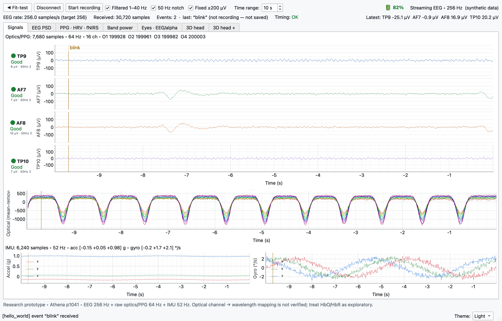
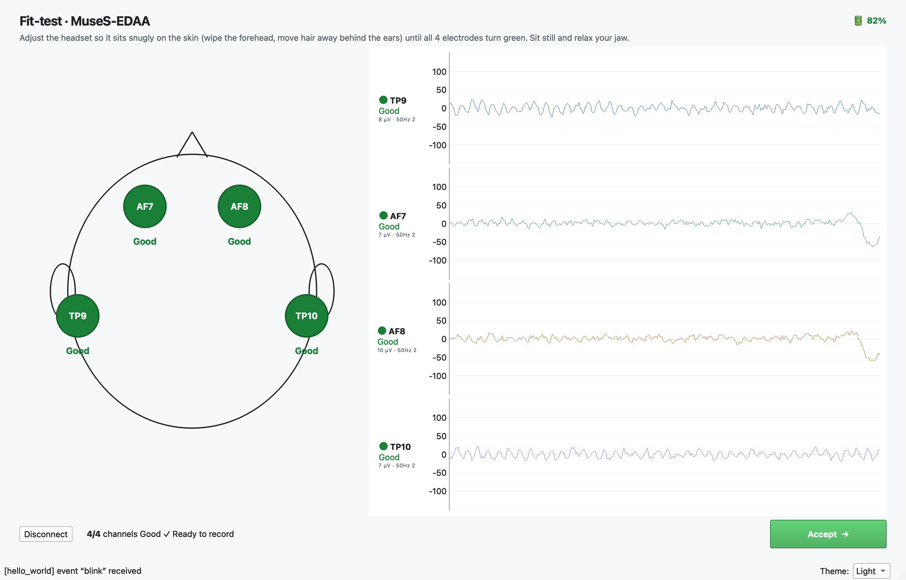
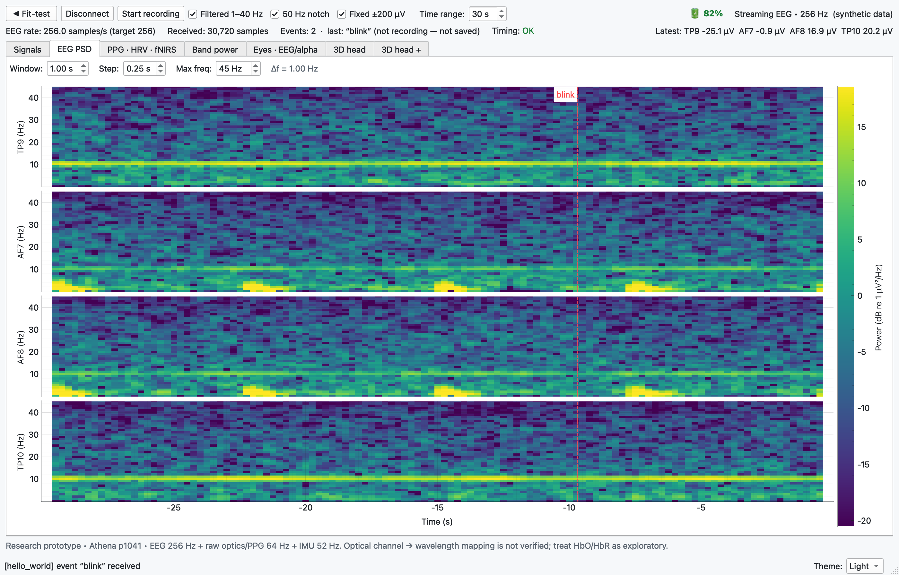
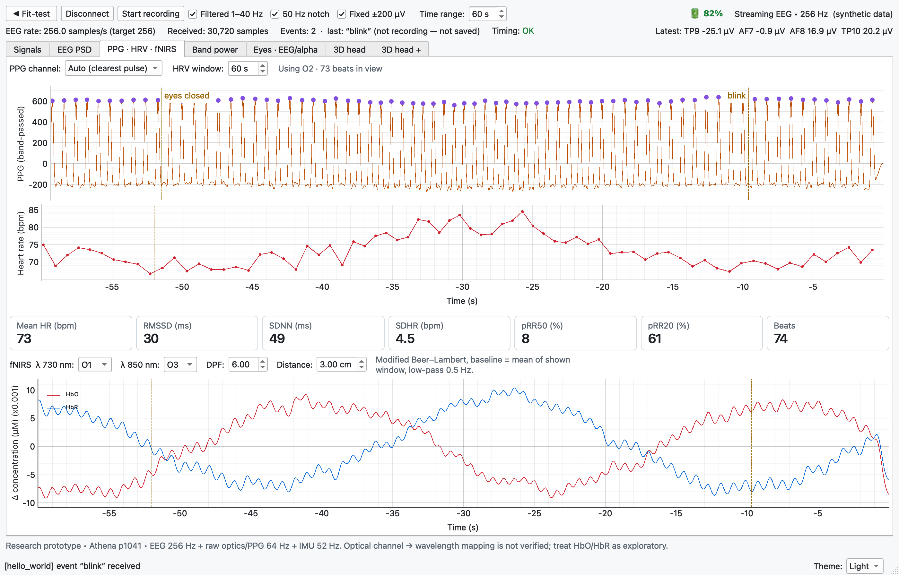
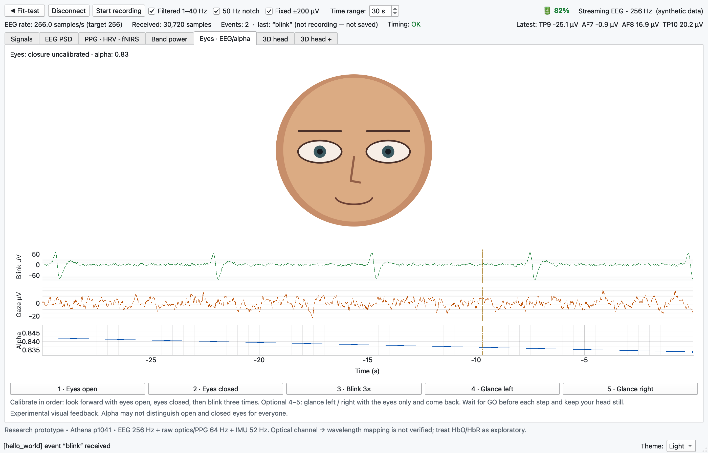
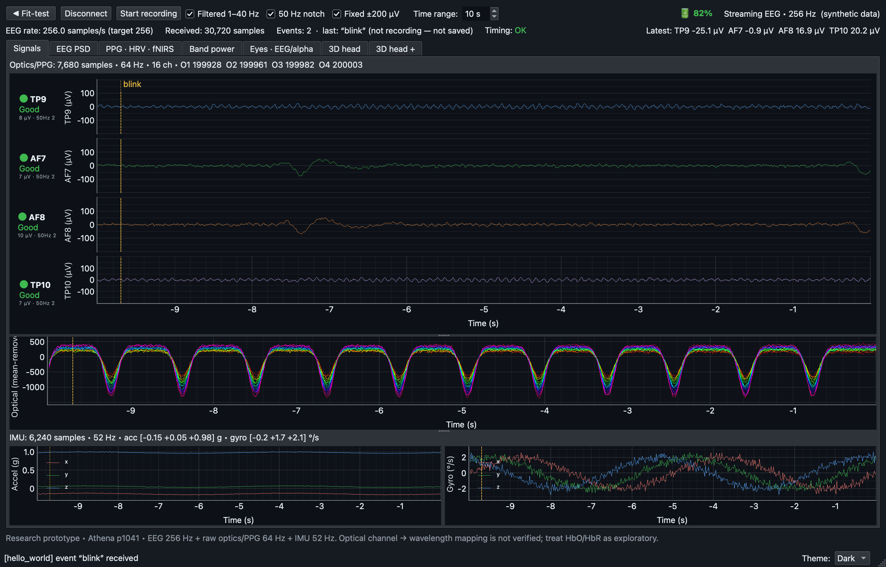

# Muse Monitor

[](https://github.com/LuanVanTran12395/muse-monitor/actions/workflows/tests.yml)

> **⚠️ Not a medical device.** Muse Monitor is a research and hobby prototype. It is not intended to
> diagnose, treat, monitor or prevent any disease or condition, and its readings (EEG quality, heart rate,
> HRV, ΔHbO/ΔHbR, eye and head estimates) must not be used for medical decisions.

Realtime biosignal monitor for **Muse S Athena**; other headsets can be added as optional device libraries.
Built with BrainFlow, bleak, PySide6 and pyqtgraph.

- EEG with an electrode contact-quality fit-test, filters, a live spectrogram and a whole-session PSD report
- PPG → heart rate → HRV (RMSSD, SDNN, SDHR, pRR50, pRR20); fNIRS ΔHbO / ΔHbR (exploratory)
- IMU (Athena), light/dark theme, one time range shared by every time-domain plot
- Manual event markers (Space), automatic session folders in `data/`
- Extensions: add tabs and analyses without touching the app (blink/glance/eye-closure, 3D head pose, band power…)

## Screenshots

*All screenshots are rendered from **synthetic** signals by `tools/make_screenshots.py` — not from a real recording.*

| | |
|---|---|
|  **Signals** — EEG with per-channel contact quality, raw optics, IMU, event markers |  **Fit-test** — electrode map and live traces before recording |
|  **EEG PSD** — spectrogram per channel (window / step / max frequency) |  **PPG · HRV · fNIRS** — beats, heart rate, HRV tiles, ΔHbO/ΔHbR |
|  **Extension `eye_interaction`** — blink / glance / alpha |  **Dark theme** |

## Quick start

```bash
./run.command                         # macOS: creates ~/.venvs/musemonitor, installs requirements, starts the app
# or, with the requirements installed:
PYTHONPATH=src python -m musemonitor
```

Requirements: Python ≥ 3.10 and the packages in `requirements.txt` (BrainFlow ≥ 5.23, PySide6, pyqtgraph,
numpy, scipy, bleak). macOS asks for **Bluetooth** access for the app that runs Muse Monitor
(Terminal or VS Code) the first time. Close any other app connected to the headset — BLE allows one
connection.

## Using the app

1. **Connect** — every supported headset in range is listed (with its type when several device
   libraries are installed), e.g. `MuseS-EDAA`. Pick one and press **Connect**.
   Choosing a device of another type opens a window configured for it; the last type used is
   reopened next time.
2. **Fit-test** — the head map turns each electrode green / amber / red from the live signal (RMS in
   1–40 Hz and mains noise; Muse does not measure impedance). Adjust until all are green, then **Accept**.
3. **Recording screen**
   - Filters (1–40 Hz band-pass, 50 Hz notch), fixed ±200 µV scale.
   - **Time range**: type a number and press Enter — it applies to every time-domain plot. The x axis
     follows only this value (mouse zoom/pan on x is disabled; y can still be zoomed).
   - **Space** marks an event: type a label, Return to save, Esc to cancel. Lines appear on all plots.
   - **Timing** readout: measured rate per stream and timestamp/packet anomalies (see *Timing*).
   - Tabs: **Signals** (EEG, optics, IMU), **EEG PSD** (spectrogram per channel; window / step / max
     frequency), **PPG · HRV · fNIRS**, plus tabs added by extensions.
4. **Theme** — Dark / Light, bottom right.

## Recording and data

**Start recording** creates `data/muse_<date>_<time>/` (no file dialog) and marks event **`0`** at the
start. **Stop** closes the files and writes the report:

| File | Content |
|---|---|
| `muse_eeg_<stamp>.csv` | timestamp, EEG channels (µV), `package_num` (Athena) |
| `…_optics.csv`, `…_imu.csv` | optical channels, accelerometer + gyroscope (only for streams the device has) |
| `…_events.csv` | `timestamp,label` — the automatic `0`, then your Space events |
| `…_bandpower.csv` etc. | files written by extensions |
| `report.html` | whole-session Welch PSD of every stream, EEG band powers + alpha peak, cardiac peak per optical channel, events |
| `psd_eeg.csv`, `psd_optics.csv`, `psd_imu.csv` | the PSD values behind the report |

Timestamps are Unix seconds, so all files can be aligned. Set `MUSEMONITOR_DATA_DIR` to record
elsewhere. Older flat recordings can be moved into session folders, with a report, by
`PYTHONPATH=src python tools/organize_data.py` (preview) and then `--apply`.

## Devices

**Muse S Athena** is built in (BrainFlow, preset p1041): EEG TP9/AF7/AF8/TP10 256 Hz, 16 raw
optical channels 64 Hz, IMU 52 Hz, battery.

Other headsets are **optional libraries** found by convention: any importable package named
`musemonitor_*` that defines `DEVICE_PROFILE` (see `src/musemonitor/device/profiles.py`). The app
never names them, so deleting a library removes that device type and the app falls back to Athena.

The optical-channel → wavelength mapping of Athena is not published by BrainFlow; its fNIRS defaults
(O1 ≈ 730 nm, O3 ≈ 850 nm) follow OpenMuse and are exploratory.

## Extensions

Extensions live in `extensions/` (or `~/.musemonitor/extensions`, `$MUSEMONITOR_EXTENSIONS`, or a pip
package). They can read live signals, add tabs and menu actions, react to events and recordings, and
write their own files. A crashing extension is disabled on its own; the app keeps running.

In the app, **Extensions ▸ Manage extensions…**:
- **⟳ Update** — load extensions added while the app is running (also **Extensions ▸ Check for new extensions**)
- **Unload / Load** — remove or restart one extension for this session
- **Enabled** — whether it loads at the next start
- **Not applicable** — the extension does not fit the connected device (its `supports(spec)` said no)

Bundled extensions:

| Extension | What it does | Needs |
|---|---|---|
| `hello_world` | minimal example: menu action, events, settings | — |
| `band_power` | relative delta…gamma power over time; `<rec>_bandpower.csv` while recording | EEG |
| `eye_interaction` | avatar + plots: blinks (AF7/AF8), left/right glances (AF7 − AF8, calibrated), eye closure from TP9/TP10 alpha | Athena EEG |
| `head_motion`, `head_motion_plus` | 3D head pose from the IMU; *plus*: guided axis calibration and an optional camera "facing the screen" reference (off by default, asks permission, frames never saved) | Athena IMU (+ `opencv-python-headless` for the camera) |

Create your own:

```bash
PYTHONPATH=src python -m musemonitor.plugins new "My Extension"   # from a working template
PYTHONPATH=src python -m musemonitor.plugins list                 # what will be loaded
```

Full guide (hooks, API, tabs, rules of thumb): [docs/EXTENSIONS.md](docs/EXTENSIONS.md).

## Development

### Architecture

```
 BLE headset ──► device/ (scanner, worker) ──signals──► ui/main_window ──► core/store (SignalStore)
                                                           │                    ▲
                                                           ├──► storage/ (CSV, session, report)
                                                           ├──► plugins/ (extension hooks) ──► extensions/
                                                           └──► ui/pages, ui/tabs (timers read the store)
```

Dependencies point one way: `ui / plugins → device / storage → core → config`; `core`, `storage` and
`config` never import Qt, so they are testable without a display. Import order matters:
numpy/scipy/brainflow must be imported before PySide6 (otherwise scipy imports very slowly) —
`musemonitor/__init__.py` handles it, so always import through the package. Rules for changing the
project: [CLAUDE.md](CLAUDE.md).

### Module roles

**Top level** — `src/musemonitor/`

| Module | Role |
|---|---|
| `__init__.py` | Package version; imports numpy/scipy/brainflow before anything can import PySide6. |
| `__main__.py` / `app.py` | Entry point (`python -m musemonitor`). `WindowManager` opens one `MainWindow` per device profile and swaps windows when a device of another type is chosen. |
| `config.py` | Every tunable constant: refresh rates, buffer lengths, filter bands, quality thresholds, PSD/PPG/fNIRS defaults, data folder. Pure Python. |

**`core/` — signal processing (numpy/scipy only)**

| Module | Role |
|---|---|
| `buffers.py` | `Ring`: fixed-size numpy ring buffer (channels × samples) for every stream. |
| `filters.py` | Cached filter design (notch, band-pass, low-pass) and `CausalFilter`, a stateful filter that continues across chunks so the live trace never has edge artefacts. |
| `quality.py` | Electrode contact quality from the signal: band RMS 1–40 Hz, mains RMS 45–55 Hz, flat-line check → Good / Fair / Bad / No signal. |
| `spectral.py` | `stft_power` (live spectrogram, aligned to the newest sample), `PsdAccumulator` (whole-session Welch PSD without keeping the signal), `band_powers`. |
| `ppg.py` | Pulse-clarity score and channel picking, beat detection with sub-sample peaks, IBI cleaning, HRV metrics. |
| `fnirs.py` | Modified Beer–Lambert: two wavelengths → ΔHbO / ΔHbR with a configurable extinction matrix. |
| `timing.py` | `StreamClock`: keeps raw timestamps untouched, counts backsteps and `package_num` anomalies, fits the display time axis. |
| `store.py` | `SignalStore`: the single data source of the UI — buffers for EEG (raw + filtered), optics and IMU, plus timing per stream. |

**`device/` — hardware**

| Module | Role |
|---|---|
| `spec.py` | `DeviceSpec` / `StreamSpec`: channel names, rows, sampling rates, `package_num` row; `athena_spec()` reads them from BrainFlow. |
| `profiles.py` | `DeviceProfile` (spec, worker factory, BLE name matcher, electrode positions, fNIRS defaults); the built-in Athena profile; discovery of optional `musemonitor_*` device libraries. |
| `scanner.py` | `BleScanner`: bleak scan in a thread, keeps devices that match a profile. |
| `worker.py` | `MuseWorker`: BrainFlow session in its own thread — connect, poll every preset, emit chunks with raw timestamps and `package_num`, write CSV while recording, report rate and battery. |

**`storage/` — files (no Qt)**

| Module | Role |
|---|---|
| `recording.py` | `Recorder`: one CSV per stream, written in blocks from the worker thread; `companion_path` for files next to a recording. |
| `events.py` | `EventWriter`: `<recording>_events.csv` (timestamp, label), flushed on every line. |
| `session.py` | `RecordingSession`: creates `data/muse_<stamp>/`, accumulates whole-session PSD while recording, writes the report on close. |
| `report.py` | Self-contained `report.html` (inline SVG charts) and `psd_*.csv`. |

**`plugins/` — extension system**

| Module | Role |
|---|---|
| `api.py` | The public API: `Extension` (hooks, `supports(spec)`) and `ExtensionContext` (`add_tab`, `add_action`, `mark_event`, settings, data folder). Extensions import only from here. |
| `loader.py` | Finds extensions in folders and pip entry points and imports each under a private module name. |
| `manager.py` | `ExtensionManager`: activate, dispatch hooks only to extensions that override them, isolate errors, enable/disable, runtime Update / Unload / Load, "not applicable" status. |
| `scaffold.py`, `__main__.py` | `python -m musemonitor.plugins new / list`: create a working extension from a template, list what will load. |

**`ui/` — PySide6 / pyqtgraph**

| Module | Role |
|---|---|
| `main_window.py` | Controller: wires pages, scanner/worker, `SignalStore`, recording session, event markers and extensions; owns the redraw / analysis / text timers. |
| `context.py` | `ViewContext`: what pages and tabs share (spec, store, settings, plot registry, theme, profile) so they never reference `MainWindow`. |
| `plotkit.py` | `PlotRegistry`: every plot registers here to follow the theme and time range, lock its x axis, and receive event markers. |
| `markers.py` | `EventMarkers`: vertical event lines placed on the shared display time axis of each stream. |
| `theme.py`, `style.py` | Light/dark colour sets and Qt palette; Fusion style with a corrected checkbox indicator. |
| `pages/` | `ConnectPage` (scan list, connect), `FitPage` (head map + traces, Accept), `RecordingPage` (control bar, tabs, timing readout, extension tabs with error isolation). |
| `tabs/` | `BaseTab` interface; `SignalsTab` (EEG, optics, IMU), `PsdTab` (spectrogram), `PpgTab` (PPG, heart rate, HRV, fNIRS). |
| `widgets/` | `HeadWidget` (electrode map), `EventDialog`, `ExtensionsDialog`, quality/battery indicator HTML. |

**Other folders**

| Path | Role |
|---|---|
| `extensions/` | Bundled extensions (table above). |
| `tools/` | `capture_athena.py` (raw BrainFlow fixture for golden tests), `organize_data.py` (old flat recordings → session folders), `make_screenshots.py` (README images from synthetic data). |
| `tests/` | pytest suite on deterministic synthetic signals; runs offscreen, no headset needed. |
| `docs/` | [EXTENSIONS.md](docs/EXTENSIONS.md) (extension guide) and screenshots. |
| `debate/` | Design proposals; structural changes are proposed here first. |
| `data/` | Local recordings (git-ignored). |

### Tests

```bash
pip install -r requirements-dev.txt
python -m pytest
```

Everything runs offscreen (`QT_QPA_PLATFORM=offscreen`, also on GitHub Actions) on deterministic synthetic signals (`tests/synthetic.py`), including a
synthetic device library that exercises the device-profile mechanism.

**Golden test on real Athena data** (locks the original CSV columns and analysis results):

```bash
PYTHONPATH=src python tools/capture_athena.py MuseS-EDAA --seconds 30          # raw BrainFlow fixture
git worktree add /tmp/mm-base <known-good commit>
PYTHONPATH=/tmp/mm-base/src python tests/golden.py bless tests/fixtures/athena_raw_<time>.npz
python -m pytest tests/test_golden_athena.py
```

### Timing

Raw timestamps are written unchanged, plus `package_num` (Athena, last column). Plots and event
markers share one display time axis: a linear fit of raw timestamps against sample index over the
last 30 s (`core/timing.py`). The **Timing** readout shows the measured rate per stream, timestamps
that went backwards (`ts↓`) and `package_num` steps other than 0/1 (`seq?` — not necessarily packet
loss; BrainFlow's rule is still being verified). HRV uses sample counts and the nominal rate.

### Extending the app itself

- **New analysis tab**: subclass `ui/tabs/base.py:BaseTab`, create plots with `ctx.plots.plot(...)`
  (theme, time range and event markers apply automatically), add it to `RecordingPage.TAB_CLASSES` —
  or ship it as an extension instead.
- **New algorithm**: a pure function in `core/` with a test in `tests/test_core.py`.
- **New parameter**: `config.py`.
- **New device**: a `musemonitor_<name>` package with a `DEVICE_PROFILE` (spec, worker with the Muse
  worker's signals, BLE name matcher, electrode positions, optional fNIRS defaults) — `tests/test_device_profiles.py` builds a
  minimal one.

## Known limitations

- Contact quality is estimated from the signal, not measured impedance.
- fNIRS ΔHbO/ΔHbR are exploratory (unverified optical-channel wavelength mapping on Athena).
- Athena `package_num` semantics are not yet understood (large `seq?` counts); a raw capture with
  `tools/capture_athena.py` is needed.
