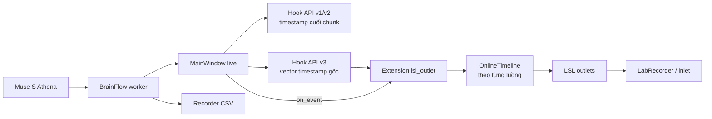

# Báo cáo triển khai LSL outlet cho Muse S Athena

**Ngày tổng hợp:** 2026-10-08  
**Trạng thái:** thiết kế đã qua các vòng phản biện; **chặng 1, extension API v3, đã triển khai, kiểm thử và commit; hợp đồng timestamp của hook đã được kiểm chứng trên Athena thật** (xem mục 7). Extension LSL và phép đo độ chính xác thời gian với LSL/XDF chưa làm. Báo cáo này là mốc tổng hợp quyết định, không phải kết quả xác nhận độ chính xác thời gian của thiết bị.

## 1. Mục tiêu và phạm vi

MuseMonitor cần phát dữ liệu **đang thu trực tiếp** từ Muse S Athena qua Lab Streaming Layer (LSL), để LabRecorder và các công cụ nghiên cứu nhận được EEG, dữ liệu quang học, IMU và event. Dữ liệu EEG phát ra là tín hiệu thô theo tên kênh của `DeviceSpec`; LSL là một đầu ra bổ sung, độc lập với nút Start recording và file CSV hiện có.

Kết quả cần có:

1. Bốn outlet riêng cho EEG, Optical, IMU và Markers, với metadata tên kênh, đơn vị và tần số danh định.
2. Timestamp LSL tăng nghiêm ngặt theo từng luồng, kèm mô tả rõ đây là **ước lượng từ timestamp phía host**, không phải timestamp lấy mẫu phần cứng.
3. Có thể bật/tắt từ menu Extensions; khi thiếu `pylsl` hoặc `liblsl`, việc đo và ghi CSV của app vẫn hoạt động.
4. Kiểm chứng giá trị, số mẫu, metadata và sai lệch thời gian bằng LSL inlet/LabRecorder và Athena thật.

Phạm vi hiện tại chỉ gồm **Muse S Athena ở cửa sổ live**. Cửa sổ review không phát lại bản ghi cũ ra LSL. CSV, `Recorder`, BrainFlow worker và dữ liệu đã ghi không đổi schema.

## 2. Hiện trạng đã kiểm tra

| Thành phần | Hiện có | Khoảng trống đối với LSL |
|---|---|---|
| Thu dữ liệu | `device/worker.py` nhận `(x, ts, seq)` cho EEG, optics, IMU; `ts` là vector timestamp từng mẫu | Chưa có outlet |
| Ghi file | `storage/recording.py` ghi vector `ts` gốc vào CSV | CSV là mốc đối chiếu, không thể dùng timestamp Unix trực tiếp cho LSL |
| Extension | API v2 có hook `on_eeg/on_optics/on_imu(x, ts_cuối_chunk)`, `on_event`, `supports(spec)`, `supports_review` | Hook cũ thiếu timestamp của từng mẫu |
| Review | `plugins/replay.py` phát lại các hook cũ trong cửa sổ riêng | LSL extension phải đặt `supports_review = False` |
| Metadata | `DeviceSpec` cho tên kênh/rate; `session.json` lưu profile và đơn vị phiên ghi | Cần ánh xạ sang `StreamInfo` của LSL |

Bản ghi Athena cục bộ `data/muse_20261008_225415` dài khoảng 16,8 giây đã được kiểm tra theo **timestamp**, không dùng giá trị EEG để lập báo cáo: 37,8% cặp mẫu EEG liên tiếp có cùng timestamp; optics là 14,1%; IMU có 5 lần timestamp đi lùi. Các số này cho thấy việc phát timestamp gốc sẽ tạo mẫu trùng thời điểm hoặc đảo thứ tự trong XDF. Chúng **không** tự chứng minh thời gian lấy mẫu thật của headband hay độ trễ BLE chính xác.

## 3. Diễn tiến proposal và debate

| Vòng | Đề xuất hoặc phản biện | Kết quả được giữ lại |
|---|---|---|
| [Proposal ban đầu](../debate/lsl-athena-proposal.md) | LSL là extension; thêm hook timestamp từng mẫu; chuyển Unix sang đồng hồ LSL; ban đầu dự kiến queue/thread | Chốt ranh giới module và nhu cầu API mới |
| [Claude phản hồi đầu](../debate/claude-lsl-athena-response.md) | Dữ liệu Athena có timestamp trùng/đi lùi; đề nghị làm đều bằng `StreamClock.fit()`, đẩy trực tiếp trong hook trước | Chấp nhận nhu cầu làm đều và đo hiệu năng trước khi thêm thread |
| [Codex vòng 2](../debate/codex-lsl-athena-round-2.md) | `StreamClock.fit()` tính lại 30 giây gần nhất, không phù hợp để xuất timestamp bất biến; `pylsl.push_chunk` nhận vector timestamp | Tách timeline xuất có trạng thái; giữ API v3 chỉ truyền dữ liệu gốc |
| [Claude vòng 2](../debate/claude-lsl-athena-round-2.md) | Đề xuất `OnlineTimeline`, bù pha/chu kỳ, gap và test mô phỏng | Có thuật toán prototype, sau đó cần sửa cách phân biệt nghẽn và khoảng trống |
| [Codex vòng 3](../debate/codex-lsl-athena-round-3.md) | Với timestamp phía host, chunk đầu sau nghẽn chưa cho biết có mất mẫu; test clock step và marker cam kết sai số quá mức | Chuyển sang trạng thái chờ, gắn nhãn không chắc chắn, bỏ ngưỡng sai số chưa đo |
| [Claude vòng 3](../debate/claude-lsl-athena-round-3.md) | Mô hình `normal / pause_pending / catching_up`, thời hạn thử C = 2 s; metadata `Optical/raw`; test bất biến | Chấp nhận làm prototype, không gọi khoảng ngừng là số mẫu mất |
| [Codex vòng 4](../debate/codex-lsl-athena-round-4.md) | `C = 2 s` không thể bảo đảm nhận diện mọi backlog; fixture cá nhân không đưa vào repo; lookahead để sau | Quy tắc và giới hạn được ghi rõ; CI dùng dữ liệu tổng hợp |
| [Claude chốt vòng 3](../debate/claude-lsl-athena-round-3.md#chốt-sau-codex-lsl-athena-round-4md) | Nhận các điều chỉnh của vòng 4 | Có thể bắt đầu API v3; tham số timeline chờ prototype và đo trên thiết bị |
| [Báo cáo chặng 1](../debate/claude-lsl-athena-stage1-report.md) | API v3 và 9 test mới đã được viết trong nhánh `api-v3` | Hook live hoạt động, hook cũ/review giữ hành vi; toàn bộ test hiện có chạy qua |

### Những điểm đã thay đổi so với proposal đầu

- **Timestamp:** từ ý tưởng đẩy timestamp gốc sang một timeline LSL tăng đơn điệu có trạng thái; raw timestamp vẫn giữ nguyên trong CSV và hook API v3.
- **Xử lý:** từ thread/queue mặc định sang phát trực tiếp trong hook ở chặng đầu, đo chi phí thực tế rồi mới quyết định có cần thread.
- **Thiết bị và tín hiệu:** metadata optics dùng `Optical/raw`, không gán toàn bộ 16 kênh thành PPG/NIRS hoặc tuyên bố biết mapping bước sóng.
- **Kiểm thử:** CI kiểm bất biến trên dữ liệu tổng hợp nhiều seed; độ lệch p50/p95/p99 được báo cáo trước khi đặt ngưỡng chất lượng.
- **Dữ liệu kiểm thử:** bản ghi cá nhân trong `data/` chỉ dùng cục bộ; không thêm timestamp trích từ đó vào repo.

## 4. Kiến trúc đã chốt

### API v3

Thêm `on_eeg_samples(x, ts_raw)`, `on_optics_samples(x, ts_raw)`, `on_imu_samples(x, ts_raw)` trong extension API. `ts_raw` là vector Unix `float64`, độ dài bằng số mẫu của `x`, cùng giá trị và thứ tự với luồng ghi CSV. Hook mới chỉ dispatch trong `MainWindow` live; các hook cũ giữ chữ ký và vẫn nhận timestamp mẫu cuối. `API_VERSION` lên 3, extension cũ vẫn dùng `requires_api ≤ 2`.

Nếu một worker cũ chỉ đưa timestamp cuối dưới dạng scalar, `ts_vector()` khai triển bằng tần số danh định. Với Athena, test phải dùng vector thật. Tài liệu cần phân biệt **timestamp quan sát** với timestamp đã được thuật toán LSL làm đều.

### Extension LSL

`extensions/lsl_outlet/` chứa logic tạo outlet, `OnlineTimeline`, ánh xạ đồng hồ và action bật/tắt. Extension yêu cầu API 3, chỉ áp dụng cho `MUSE_S_ATHENA_BOARD`, đặt `supports_review = False`, mặc định tắt. `pylsl` là phụ thuộc tuỳ chọn; kiểm tra khả năng nhận **vector timestamp** của `push_chunk` khi bật. Tài liệu `pylsl` hiện mô tả vector timestamp cho từng mẫu; truyền một số duy nhất sẽ khiến nó suy các mẫu còn lại theo rate danh định. [pylsl `push_chunk`](https://github.com/labstreaminglayer/pylsl/blob/main/src/pylsl/outlet.py)

| Outlet dự kiến | LSL `type` | Kênh và đơn vị |
|---|---|---|
| `MuseMonitor-Athena-EEG` | `EEG` | `spec.eeg.names`, `microvolts` |
| `MuseMonitor-Athena-Optical` | `Optical` | `O1…O16`, `raw` |
| `MuseMonitor-Athena-IMU` | `IMU` | `acc_*`: `g`; `gyro_*`: `deg/s` |
| `MuseMonitor-Athena-Markers` | `Markers` | nhãn string, rate không đều |

`source_id` dự kiến chứa profile, mã băm định danh thiết bị và loại luồng; hai thiết bị trùng tên BLE có thể vẫn trùng ID, nên cần ghi giới hạn đó. Không thêm `raw_unix_ts` như một kênh EEG vì CSV đã lưu giá trị này và kênh bổ sung sẽ đổi cấu trúc outlet EEG.

## 5. Quy tắc timestamp và giới hạn của nó

LSL dùng `local_clock()` đơn điệu, còn worker và event dùng Unix time. Extension đo cặp đồng hồ gần nhau ở mỗi hook để đổi timestamp gốc sang miền LSL; khi Unix clock nhảy giữa hai chunk, offset mới triệt phần lớn bước nhảy. Nếu bước nhảy xảy ra **trong** chunk, một phần mẫu có thể thuộc epoch cũ; chunk đó được đánh dấu `timing_uncertain`. LSL cung cấp thông tin để phần mềm nhận đồng bộ các stream, nhưng không thể tự sửa độ trễ thu tín hiệu trước khi vào app. [LSL time synchronization](https://github.com/sccn/labstreaminglayer/blob/master/docs/info/time_synchronization.rst)

`OnlineTimeline` chạy riêng cho EEG, Optical, IMU; đầu vào là timestamp gốc đã chuyển sang miền LSL. Nó giữ thời gian mẫu cuối đã phát và chu kỳ ước lượng, sửa pha/chu kỳ có giới hạn, **không sửa các timestamp đã phát**. Bản prototype có ba trạng thái:

- `normal`: phát theo chu kỳ gần đều và cập nhật chậm theo quan sát.
- `pause_pending`: thấy thời gian tới lệch lớn thì tiếp tục theo số mẫu, chờ xem dữ liệu có tới bù; chưa nhảy timeline.
- `catching_up`: timeline đang đi trước quan sát thì đi chậm có giới hạn, không phát timestamp lùi.

Ngưỡng thử ban đầu: `G = max(0,25 s, 10·p)` cho độ lệch lớn; `C = 2 s` là thời hạn chờ sau khi nhận lại; cửa sổ quan sát 30 s. Hết C mà chưa bắt kịp, timeline có thể nhảy **tiến** và ghi `timing_uncertain`/`pauses_unrecovered`. `unrecovered` chỉ có nghĩa *chưa hồi phục trong C*, **không phải xác nhận mất gói**. Dữ liệu tới bù muộn hơn C vẫn có thể xảy ra. Tuỳ chọn giữ dữ liệu lại 2 s (`lookahead`) được hoãn, vì nó tăng độ trễ và cũng không bảo đảm phân loại đúng mọi trường hợp.

Marker dùng thời điểm Unix lúc người dùng bấm Space, không phải lúc đóng hộp nhập nhãn. Extension tra lịch sử offset để chuyển thời điểm ấy sang miền LSL. Nếu giờ hệ thống nhảy trong lúc hộp nhập đang mở, marker được gắn `uncertain`; API hiện không giữ đồng thời thời điểm LSL tại lúc bấm để giải quyết hoàn toàn ca này. So sánh marker với EEG chỉ là so theo **timeline host ước lượng**, không phải bảo đảm canh đúng thời điểm sinh lý trong vài mili giây.

Các tham số bù pha `g = 0,1`, giới hạn slew `s = 1e-3`, cập nhật chu kỳ tối đa 200 ppm/lần và cửa sổ 30 s là **giả thuyết để thử**. Prototype phải đo trước khi chọn ngưỡng chất lượng. Không dùng `StreamClock.fit()` trực tiếp để xuất: phép khớp của plot tính lại cửa sổ gần nhất khi có dữ liệu mới, trong khi timestamp LSL đã phát phải bất biến.

## 6. Kế hoạch triển khai và cổng kiểm chứng

| Chặng | Công việc | Điều kiện chuyển chặng |
|---|---|---|
| 1. API v3 | Thêm ba hook timestamp từng mẫu, giữ hook cũ; cập nhật tài liệu và test | Vector hook khớp dữ liệu worker/CSV, review không dispatch hook mới, test extension cũ pass |
| 2. Timeline prototype | Cài lớp thuần Python; mô phỏng jitter, chunk ngẫu nhiên, pause có/không bù, clock step, đổi rate trên 20 seed | Timestamp tăng nghiêm ngặt, không sửa quá khứ; trạng thái/counters đúng theo từng fixture; ghi p50/p95/p99 và các ca `uncertain` |
| 3. EEG + Markers | Tạo outlet float32 và marker string; phát bằng `push_chunk` với vector timestamp; kiểm tra thiếu `pylsl` | Fake `pylsl` trong CI xác nhận số mẫu, kênh, marker, metadata, bật/tắt và reconnect |
| 4. Đo tích hợp | Dùng inlet/LabRecorder trên macOS khi Athena thật đang stream; đo chi phí hook, redraw và đối chiếu CSV/XDF | Có số liệu thực để quyết định có cần queue/thread và đặt ngưỡng chất lượng; so mẫu chỉ trong khoảng cả CSV và XDF cùng ghi |
| 5. Optical + IMU | Thêm hai outlet bằng cùng cơ chế đã đo; tài liệu cài đặt/trạng thái | Metadata, giá trị, rate, timestamp và vòng đời outlet được kiểm tra; nêu giới hạn chưa biết của optics |

Đẩy trực tiếp trong hook là **quyết định thử ở chặng đầu**, không phải cam kết hiệu năng. Nếu đo trên Athena với LabRecorder thấy hook chiếm thời gian đáng kể hoặc tạo backlog Qt, chuyển sang queue có giới hạn và thread phát riêng; khi đó cần chính sách drop và báo lỗi thread về GUI.

CI dùng `pylsl` giả để tránh phụ thuộc khám phá stream qua mạng. Test inlet và LabRecorder thật chạy ngoài CI. Fixture từ bản ghi cá nhân trong `data/` không được thêm vào `tests/fixtures/`; test cục bộ có thể tự bỏ qua khi không có file. Trên macOS, thử import bản `pylsl` thực tế trước; hướng dẫn cài `liblsl` qua Homebrew/conda hoặc `PYLSL_LIB` nếu import thất bại. [pylsl installation](https://github.com/labstreaminglayer/pylsl)

## 7. Quyết định, việc hoãn và trạng thái hiện tại

**Đã thống nhất về kỹ thuật:** extension live cho Athena; API v3 tương thích ngược; timestamp raw chỉ trong hook/CSV, timeline LSL làm đều có trạng thái; vector timestamp cho `push_chunk`; marker theo thời điểm bấm; optics `Optical/raw`; CI dùng dữ liệu tổng hợp. `CLAUDE.md` yêu cầu proposal và sự cho phép của người dùng trước khi đổi giao diện công khai; [báo cáo chặng 1](../debate/claude-lsl-athena-stage1-report.md) ghi nhận người dùng đã duyệt chặng API v3. Sự đồng ý kỹ thuật giữa Codex và Claude không thay quyền quyết định phạm vi các chặng tiếp theo.

**Hoãn tới khi có số đo:** chốt tham số timeline, ngưỡng p99, thread/queue, `lookahead`, panel trạng thái, tự bật khi kết nối và xác nhận độ chính xác timestamp trên thiết bị thật.

**Trạng thái chặng 1 (2026-10-09):** API v3 đã commit (`API_VERSION = 3`, ba hook mới). Chưa có `extensions/lsl_outlet/` và chưa thêm `pylsl` vào dependencies; đây chưa phải tính năng LSL hoàn chỉnh.
- Test với Qt offscreen: toàn bộ suite **156 passed, 3 skipped**; riêng `tests/test_api_v3.py` **9 passed**.
- **Athena thật:** extension kiểm tra `TS Check` (ngoài repo) so chuỗi `ts_raw` của hook với cột `timestamp` của CSV trong một phiên khoảng 30 s. Cả ba luồng **OK**, trùng từng bit: EEG 7752 mẫu (38 % Δts = 0), optics 1936 (14 %), IMU 1569 (2 lần đi lùi). Chi tiết ở [báo cáo chặng 1](../debate/claude-lsl-athena-stage1-report.md).
- Đây chỉ là kiểm chứng hợp đồng của hook. Chưa kiểm thử inlet, XDF hay độ chính xác thời gian.

## 8. Tệp dự kiến / đã liên quan

| Tệp | Vai trò |
|---|---|
| `src/musemonitor/plugins/api.py`, `manager.py`, `ui/main_window.py` | API v3 và dispatch (đã commit) |
| `tests/test_api_v3.py` | 9 test hook mới (đã commit) |
| `extensions/lsl_outlet/__init__.py`, `timeline.py`, `README.md` | Outlet, timeline, vòng đời, hướng dẫn (chưa có) |
| `docs/EXTENSIONS.md`, `README.md` | Hợp đồng API v3 (đã commit) |
| `pyproject.toml` | Extra `lsl` (chưa cập nhật) |
| `tests/test_lsl_outlet.py` | Test giả lập/LSL tích hợp (chưa có) |

Tài liệu gốc của các quyết định nằm trong `debate/` và được liên kết ở mục 3. Báo cáo này cần được cập nhật sau mỗi chặng bằng **kết quả đo hoặc test cụ thể**, không chuyển giả thuyết về timestamp thành tuyên bố đã xác minh.
